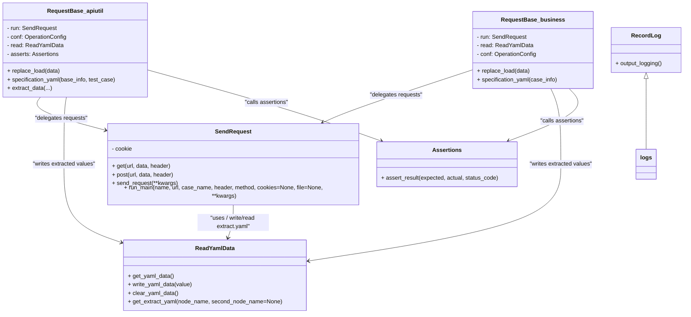
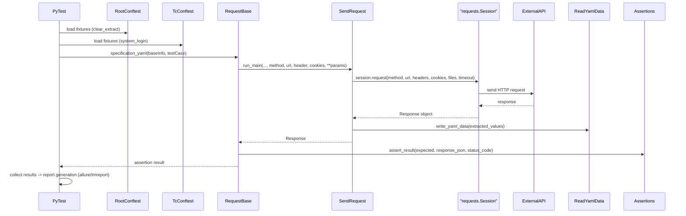

# 项目架构说明

## 概述

该仓库实现了一个基于 Pytest 的接口自动化测试框架，目标是提供通用的测试组织、请求发送、用例驱动、报告生成与运行脚本。本文档面向开发/测试工程师，描述项目目录、关键模块职责、运行流程与扩展点。

## 目录结构（高层）

- `base/`：基础工具与公共业务工具（如 API 封装、ID 生成、文件操作）。
- `common/`：框架的核心公共组件（日志、请求发送、yaml/csv 操作、断言、邮件、钉钉机器人等）。
- `conf/`：配置片段（如 `config.ini`、`setting.py`），控制报告类型、超时等全局设置。
- `data/`：测试数据（CSV、YAML、SQL XML 等）。
- `testcase/`：测试用例目录，按业务模块组织实际测试脚本与数据。
- `report/`：测试报告输出目录（Allure、tmreport 等），`temp/` 存放临时附件。
- `docs/`：项目文档（本文件位于此处）。
- `run.py`：框架入口脚本，用于触发 pytest 并生成相应类型报告。

## 关键模块说明

- `run.py`：读取 `conf.setting.REPORT_TYPE`，决定以 Allure 还是 tmreport 生成报告，调用 `pytest.main()` 并拷贝环境信息到报告目录后打开报告（Allure 会调用 `allure serve`）。

- `conf/setting.py`（位置）: 放置运行常量，如 `REPORT_TYPE`、`API_TIMEOUT` 等（通过该模块控制运行行为）。

- `common/sendrequest.py`：HTTP 请求封装核心类 `SendRequest`：
  - 提供 `get`、`post`、`send_request`、`run_main` 等方法。
  - 使用 `requests` 会话发送请求并处理异常、记录耗时、解析 JSON 并返回统一的 response_dict 或原始 `requests.Response`。
  - 在 `send_request` 中会写入 cookie 到 yaml（通过 `common/readyaml.ReadYamlData`），并将请求/响应信息写入日志与 Allure 附件。

- `common/recordlog.py`：日志统一入口（用于记录 debug/info/error，供其他模块引用）。

- `base/apiutil.py` / `base/apiutil_business.py`：通常用于封装与业务相关的 API 组合调用或上层工具，便于测试用例直接调用更高层的操作。

- `common/readyaml.py`、`common/handleExcel.py`、`common/operationcsv.py`：提供测试数据读写能力，支持 yaml/csv/excel 等常用格式。

- `testcase/`：放置测试文件（pytest 风格，`pytest.ini` 指定 `python_files = test_*.py`，`python_classes = Test*`，`python_functions = test`），按业务模块分目录组织实际用例。

## 运行与报告

- 开发时可直接运行 `python run.py`：
  - 当 `REPORT_TYPE == 'allure'` 时，运行 pytest 并把结果导到 `./report/temp`，同时复制 `environment.xml` 到 `report/temp`，最后用 `allure serve` 展示报告。
  - 当 `REPORT_TYPE == 'tm'` 时，运行 tmreport 插件并打开 `report/tmreport/testReport.html`。

- 也可直接通过 `pytest` 命令运行（`pytest.ini` 中有常用配置）。

## 测试发现与执行流程

1. `pytest` 根据 `pytest.ini` 在 `testcase/` 中发现测试。
2. `conftest.py`（项目根或 `testcase/`）提供 fixture、环境初始化（如 session、db 连接、配置加载等）。
3. 测试用例通过业务层/工具（位于 `base/` 或 `common/`）构造请求并调用 `common/sendrequest.SendRequest.run_main()` 执行请求。
4. 请求结果由 `SendRequest` 统一返回并在用例中断言（`common/assertions.py` 可包含常用断言封装）。
5. 运行完成后，`run.py` 控制报告生成与展示。

## 配置与环境

- 全局配置位于 `conf/config.ini` 和 `conf/setting.py`：用于管理环境地址、超时、报告类型等。
- 依赖在 `pyproject.toml` 中声明，包含 `pytest`、`requests`、`allure-pytest`、`pyyaml` 等。

## 报告与日志

- Allure：通过 `allure-pytest` 插件生成富报告，`run.py` 中的 `--alluredir=./report/temp` 为默认导出目录。
- 日志：`common/recordlog.py` 提供集中日志入口，`SendRequest` 等模块会将请求/响应写入日志与 Allure 附件，便于问题回溯。

## 测试数据管理

- 数据文件统一放在 `data/`（CSV、YAML、SQL/XML 等），通过 `common/readyaml.py`、`common/handleExcel.py` 等工具读取。

## 扩展点与建议

- 当要支持更多认证/会话管理时，可在 `common/sendrequest.py` 增加会话管理或使用 `requests.Session` 的集中管理。
- 若需并发压力测试、限流或重试机制，可在请求封装层增加重试装饰器或引入 `tenacity` 等库。
- 若要把测试集成到 CI（Jenkins/GitLab CI），建议把 `run.py` 的逻辑拆成可被 CI 传参的函数或直接在 CI 中执行 `pytest` 并收集 `report/temp`。

## 注意事项

- 请勿直接修改框架运行时依赖的 `conf/setting.py` 而不记录变更；推荐使用环境变量或 CI 参数覆盖。
- `common/sendrequest.py` 中对 `response.json().get('body')` 的解析在返回非 JSON 或结构不同时可能抛异常，使用时请在用例层做兼容性校验。

## 常用命令

```bash
python run.py        # 通过 run 脚本运行并展示报告（依据 conf.setting 设置）
pytest -q            # 直接运行 pytest
pytest --maxfail=1   # 出现 1 个失败即停止
```

---

若需要我进一步生成更详细的类/函数关系图（如 mermaid 图）、补充 conftest 内 Fixture 文档或把 README 中的运行示例补齐到 docs，我可以继续完成。

## Fixtures（`conftest.py`）

项目在根目录和 `testcase/` 下都包含 `conftest.py`，框架通过 fixture 做全局初始化、环境清理、登录与测试摘要通知，关键 fixture 如下：

- 根目录 `conftest.py`：
  - `clear_extract`（scope=`session`, autouse=True）
    - 关闭 ResourceWarning 与 HTTPS 警告。
    - 调用 `common.readyaml.ReadYamlData.clear_yaml_data()` 清理上次运行遗留的数据。
    - 调用 `base.removefile.remove_file("./report/temp", ['json','txt','attach','properties'])` 清理报告临时文件。
  - `generate_test_summary(terminalreporter)` / `pytest_terminal_summary(...)`
    - 在测试结束时生成测试汇总（总数、通过、失败、错误、跳过、耗时），并根据 `conf.setting.dd_msg` 决定是否通过钉钉机器人 `common.dingRobot.send_dd_msg` 发送通知。

- `testcase/conftest.py`：
  - `start_test_and_end`（autouse=True）
    - 每个测试函数前后输出开始/结束日志（`common.recordlog.logs`）。
  - `system_login`（scope=`session`, autouse=True）
    - 读取 `./data/loginName.yaml`，并通过 `base.apiutil.RequestBase().specification_yaml(...)` 执行登录接口，保证会话或鉴权在整个测试会话中可用；若登录失败会记录错误并退出。
  - `datadb_init`（scope=`session`, autouse=True）
    - 为后置数据库清理预留位置（示例中被注释掉），可在测试后执行数据清理操作并在 Allure 附件中记录清理信息。

这些 fixture 保证了：测试前环境清洁、必要的登录/会话准备、每个用例有稳定的日志输出，以及测试结束后的通知与临时文件清理。

## 简要流程 mermaid 图

下面的 mermaid 流程图描述了测试执行的主要调用链与报告流程。

```mermaid
flowchart TD
  Runner[pytest / run.py] -->|发现测试| Testcase[testcase/*.py]
  Runner -->|加载| RootConftest[conftest.py (root)]
  Runner -->|加载| TcConftest[testcase/conftest.py]
  Testcase -->|调用| RequestBase[base.RequestBase / apiutil]
  RequestBase -->|封装调用| SendRequest[common.sendrequest.SendRequest]
  SendRequest -->|HTTP| ExternalAPI[外部服务]
  ExternalAPI -->|响应| SendRequest
  SendRequest -->|返回| Testcase
  Runner -->|生成| Report[report (allure / tmreport)]
  RootConftest -->|发送摘要| DingDing[钉钉机器人通知]
```

（说明：如需更细化的类图或每个模块的内部方法调用关系，我可以基于代码生成更详细的 mermaid 类/时序图。）

## 详细 mermaid 图

下面给出两个更细化的 mermaid 图：一个类图（class diagram），和一个典型请求执行的时序图（sequence diagram）。可以直接在支持 mermaid 的渲染器中展示。

### 类图



### 时序图（典型用例执行流程）



如需把这些 mermaid 图导出为 PNG/SVG 或添加到 CI 文档中，我可以为你生成渲染图像并把文件放入 `docs/assets/`。
